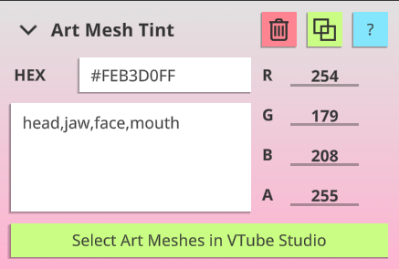
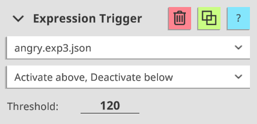
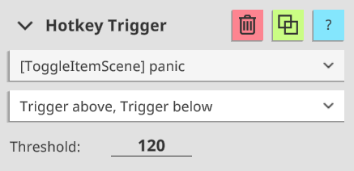
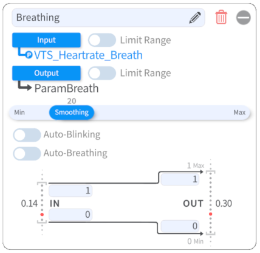

# VTS-Heartrate
A VTube Studio plugin that allows for connectivity between heart rate monitors (HRM) and VTube Studio!
 
[Download the latest version here!](https://skeletom-ch.itch.io/vts-heartrate) Or, in the [release section](https://github.com/FomTarro/vts-heartrate/releases) of this repo.


 
# Features

💓 Support for <b>many heart rate monitors</b> with [pulsoid.net](https://www.pulsoid.net), [hyperate.io](https://www.hyperate.io/) and [ANT+](https://www.thisisant.com/consumer/ant-101/what-is-ant)!  

💓 Configurable <b>model tinting</b> that scales with pulse!

💓 Automatic <b>expression and hotkey triggering</b> at desired heartrate thresholds!

💓 Custom <b>tracking parameters</b> for pulse and breath!

💓 NEW! <b>Plugin API</b> so that you can build your own apps that consume or write heartrate data!

# Table of Contents
* [About](#about)
* [Usage](#usage)
    * [Heartrate Input Methods](#heartrate-input-methods)
        * [Test Slider](#test-slider)
        * [Read from File](#read-from-file)
        * [API WebSocket](#api-websocket)
        * [Pulsoid](#pulsoid)
        * [ANT+](#ant)
        * [HypeRate](#hyperate)
    * [Outputs](#outputs)
        * [Art Mesh Tinting](#art-mesh-tinting)
        * [Automatic Expression Triggering](#automatic-expression-triggering)
        * [Automatic Hotkey Triggering](#automatic-hotkey-triggering)
        * [Custom Tracking Parameters](#custom-tracking-parameters)
    * [Profiles](#profiles)
* [API](#api)
    * [Data API](#data-api)
    * [Events API](#event-api)
    * [Input API](#input-api)
        * [Authenticating Your Plugin](#authenticating-your-plugin)
        * [Writing Heartrate Data](#writing-heartrate-data)
    * [Errors](#errors)
* [Roadmap](#roadmap)


# About
This plugin is developed by Tom "Skeletom" Farro. If you need to contact him, the best way to do so is via [Twitter](https://www.twitter.com/FomTarro).

If you're more of an email-oriented person, you can contact his support email: [tom@skeletom.net](mailto:tom@skeletom.net).

# Usage
Getting up and running is relatively straightforward. The plugin will automatically connect to VTube Studio on launch. From there, do the following steps:

* Input an estimated <b>minimum</b> and <b>maximum</b> heartrate.
* Select a desired heartrate <b>input method</b>. You can connect over bluetooth using your phone and [pulsoid.net](https://www.pulsoid.net) or [hyperate.io](https://www.hyperate.io/), or connect directly to your PC with an [ANT+](https://www.thisisant.com/consumer/ant-101/what-is-ant) USB dongle.
* Add [<b>Art Mesh Tint modules</b>](#art-mesh-tinting) and configure them to parts of your model!
* Add [<b>Expression and Hotkey Trigger modules</b>](#automatic-expression-triggering) and configure them to activate model functions automatically!
* Hook up [<b>Custom Tracking Parameters</b>](#custom-tracking-parameters), to your model for things like breathing speed!
 

## Heartrate Input Methods
In the interest of being widely accessible, this plugin features a wide set of possible input methods, which you may freely switch between at any time.
 
### Test Slider
The slider is primarily useful for quick testing of different heartrate values. The slider range is from 0 to 255.
 
### Read from File
This input method allows you to read heartrate data from an external file.
The file must simply contain the <b>numeric heartrate value</b> in <b>plain text</b>. File path must be absolute. Useful if you have another program that can output heartrate data.
 
### API WebSocket
This input method allows you to read heartrate data from the <b>Input API</b>. For more information about the API, consult the [API Documentation](#API).

### Pulsoid
[<b>Pulsoid</b>](https://www.pulsoid.net) is a free third-party app for Android/iOS which allows for easy, reliable connectivity to a wide set of heartrate monitors via the Bluetooth of your mobile device. 

Once you have a Pulsoid account, you can use this input method to collect heartrate data from the service.
 
By clicking the <b>'Login' button</b> in the plugin, you will be asked to grant this plugin permission to connect to your account. You will then be given an <b>'Authentication Token'</b> which you must paste into the plugin.
 
### ANT+
[<b>ANT+</b>](https://www.thisisant.com/consumer/ant-101/what-is-ant) is a low-power protocol supported by many sport and fitness sensors.

This input method allows for direct connection to your ANT+ device, provided that you have a <b>USB receiver</b> plugged in.

By clicking the <b>'Refresh' button</b>, this plugin will begin a continuous scan for devices that output heartrate data.
Then, simply select one from the dropdown and click the <b>'Connect' button</b>.

Please note that this plugin is not an officially licensed or certified affiliate of the ANT+ Brand.

### HypeRate
[<b>HypeRate</b>](https://www.hyperate.io/) is a free third-party app for Android/iOS which allows for easy, reliable connectivity to a wide set of heartrate monitors via the Bluetooth of your mobile device. 

Once you have a HypeRate account, you can use this input method to collect heartrate data from the service.

## Outputs
 
### Art Mesh Tinting
This output will gradually tint the matched <b>Art Meshes</b> the desired color, based on your current heartrate. For example, you can use this to make your model's face flushed for workouts, or run cold during horror games.
 
<b>Art Meshes</b> are matched as long as their names or tags contain <b>any</b> of the provided list of text to match. For example, providing the text '<b>head,mouth,neck</b>' will match Art Meshes with names like '<b>forehead</b>', '<b>outermouth2</b>', and '<b>leftneckside1</b>'.
Text to match must be <b>comma separated</b> and should <b>not contain spaces</b>.
 
If you are unsure of what your Art Meshes are named, a great web-tool was developed by <b>Hawkbar</b> called [<b>VTubeStudioTagger</b>](https://hawk.bar/VTubeStudioTagger/), which offers an intuitive way to discover the names of your model's Art Meshes.
 


### Automatic Expression Triggering
This output will cause an <b>Expression</b> to <b>activate or deactivate</b> when the current heartrate is <b>above or below a given threshold</b>, based on the selected behavior settings.

For example, the configuration in the provided image will cause the `angry` Expression to automatically activate when the heartrate exceeds 120 BPM, and will deactivate when the heartrate falls back beneath 120 BPM.



### Automatic Hotkey Triggering
This output will cause a <b>Hotkey</b> to be triggered when the current heartrate is <b>above or below a given threshold</b>, based on the selected behavior settings.
 
For example, the configuration in the provided image will cause the `panic` Item Scene to automatically toggle when the heartrate exceeds 120 BPM, and will toggle again when the heartrate falls back beneath 120 BPM.



### Custom Tracking Parameters
This plugin outputs <b>fifteen custom tracking parameters</b> for use. They are as follows:
 
* `VTS_Heartrate_Linear`: A value that scales from 0.0 to 1.0 as your heartrate moves across the expected range.
* `VTS_Heartrate_Pulse`: A value that bounces back and forth between 0.0 and 1.0 with a frequency exactly matching your heartrate.
* `VTS_Heartrate_Breath`: A value that bounces back and forth between 0.0 and 1.0 with a frequency slower than `VTS_Heartrate_Pulse`, suitable for controlling your model's `ParamBreath` output parameter.

The following parameters are primarily suited for controlling Live2D props, but you may also find them useful of your model:

* `VTS_Heartrate_BPM`: A value that represents the actual current BPM from 0 to 255, rather than a normalized value from 0.0 to 1.0.
* `VTS_Heartrate_BPM_Ones`: A value from 0 to 9 that represents the first digit of the current BPM. For example, with a heartrate of 95, this parameter would be 5.
* `VTS_Heartrate_BPM_Tens`: A value from 0 to 9 that represents the second digit of the current BPM. For example, with a heartrate of 95, this parameter would be 9.
* `VTS_Heartrate_BPM_Hundreds`: A value from 0 to 9 that represents the third digit of the current BPM. For example, with a heartrate of 95, this parameter would be 0.
* `VTS_Heartrate_Repeat_1`: A value that scales linearly from 0.0 to 1.0 and resets back to 0.0 with every heartbeat.
* `VTS_Heartrate_Repeat_5`: A value that scales linearly from 0.0 to 1.0 and resets back to 0.0 with every 5 heartbeats.
* `VTS_Heartrate_Repeat_10`: A value that scales linearly from 0.0 to 1.0 and resets back to 0.0 with every 10 heartbeats.
* `VTS_Heartrate_Repeat_20`: A value that scales linearly from 0.0 to 1.0 and resets back to 0.0 with every 20 heartbeats.
* `VTS_Heartrate_Repeat_30`: A value that scales linearly from 0.0 to 1.0 and resets back to 0.0 with every 30 heartbeats.
* `VTS_Heartrate_Repeat_60`: A value that scales linearly from 0.0 to 1.0 and resets back to 0.0 with every 60 heartbeats.
* `VTS_Heartrate_Repeat_120`: A value that scales linearly from 0.0 to 1.0 and resets back to 0.0 with every 120 heartbeats.
* `VTS_Heartrate_Repeat_Breath`: A value that scales linearly from 0.0 to 1.0 and resets back to 0.0 with the frequency of the `VTS_Heartrate_Breath` parameter.


For more information on how to integrate these tracking parameters into your model, please refer to the [Official VTube Studio documentation](https://github.com/DenchiSoft/VTubeStudio/wiki/Plugins#what-are-custom-parameters).
 



## Profiles
As of version 1.2.0, vts-heartrate supports <b>profiles</b>.

Profiles allow you to have <b>multiple output configurations</b> for the same model. For example, you may want one profile where you go blue in the face for Horror Games, and another profile where you flush red and activate a sweating expression for Workouts.

You can even <b>copy profile configurations</b> from one profile to another, even across models. This is useful if you have multiple variations of the same base model, such as different outfits.

When a model is loaded in VTube Studio, a <b>DEFAULT</b> profile is automatically loaded along with it. User-created profiles <b>must be loaded manually</b>.


# API
As of version 1.2.0, vts-heartrate features its own <b>Plugin API</b>, so that you can build your own apps that consume or write heartrate data! That's right, this VTube Studio plugin now supports plugins of its own.
 
There are three underlying API endpoints, all accessible via WebSocket: the [Data API](#Data-API), the [Events API](#Events-API), and the [Input API](#Input-API).
 
## Data API
 
The <b>Data API</b> is a read-only endpoint accessible at `ws://localhost:<your chosen port>/data`. Upon connecting to this endpoint, your WebSocket will receive a message containing current heartrate and output parameter data once per frame (60 times per second).
 
The message structure is as follows:
```
{
    apiVersion: "1.0",
    messageType: "DataResponse",
    timestamp: 1656382245785
    data: {
        heartrate: 103,
        parameters: {
            vts_heartrate_bpm: 103,
            vts_heartrate_bpm_hundreds: 1,
            vts_heartrate_bpm_ones: 3,
            vts_heartrate_bpm_tens: 0,
            vts_heartrate_breath: 0.29349666833877563,
            vts_heartrate_linear: 1,
            vts_heartrate_pulse: 0.994240403175354,
            vts_heartrate_repeat_1: 0.27418050169944763,
            vts_heartrate_repeat_5: 0.07212083041667938,
            vts_heartrate_repeat_10: 0.3203545808792114,
            vts_heartrate_repeat_20: 0.12136854976415634,
            vts_heartrate_repeat_30: 0.4221900999546051,
            vts_heartrate_repeat_60: 0.714303731918335,
            vts_heartrate_repeat_120: 0.932239294052124,
            vts_heartrate_repeat_breath: 0.29349666833877563
        },
        tints: [
            {
                baseColor: { r: 255, g: 128, b: 128, a: 255 },
                currentColor: { r: 255, g: 200, b: 200, a: 255 },
                matchers: ['head', 'face']
            },
            {
                baseColor: { r: 255, g: 128, b: 128, a: 255 },
                currentColor: { r: 255, g: 200, b: 200, a: 255 },
                matchers: ['mouth', 'neck']
            }
        ]
    }
}
```
For more information about the output parameters, consult the [Custom Tracking Parameter Documentation](#Custom-Tracking-Parameters) and [Art Mesh Tinting Documentation](#Art-Mesh-Tinting).
 
## Event API
 
The <b>Event API</b> is a read-only endpoint accessible at `ws://localhost:<your chosen port>/events`. Upon connecting to this endpoint, your WebSocket will receive a message containing event information every time an [Expression Trigger](#Automatic-Expression-Triggering) or [Hotkey Trigger](#Automatic-Hotkey-Triggering) is triggered.
 
For <b>Expressions</b>, the message structure is as follows:
```
{
    apiVersion: "1.0",
    messageType: "ExpressionEventResponse",
    timestamp: 1656382245785
    data: {
        threshold: 120,
        heartrate: 121,
        expression: "angry.exp3.json",
        behavior: 2,
        activated: true
    }
}
```
 
The complete list of possible `behavior` values is as follows:
```
UNKNOWN = -1,    
ACTIVATE_ABOVE_DEACTIVATE_BELOW = 0,
DEACTIVATE_ABOVE_ACTIVATE_BELOW = 1,
ACTIVATE_ABOVE = 2,
DEACTIVATE_ABOVE = 3,
ACTIVATE_BELOW = 4,
DEACTIVATE_BELOW = 5,
```
 
For <b>Hotkeys</b>, the message structure is as follows:
```
{
    apiVersion: "1.0",
    messageType: "HotkeyEventResponse",
    timestamp: 1656382245785
    data: {
        threshold: 120,
        heartrate: 121,
        hotkey: "Blush",
        behavior: 1
    }
}
```
 
The complete list of possible `behavior` values is as follows:
```
UNKNOWN = -1,    
ACTIVATE_ABOVE_ACTIVATE_BELOW = 0,
ACTIVATE_ABOVE = 1,
ACTIVATE_BELOW = 2,
```
 
## Input API
 
The <b>Input API</b> is a read and write endpoint accessible at `ws://localhost:<your chosen port>/input`. Upon connecting to this endpoint, your WebSocket will be able to write heartrate data for use with the [API WebSocket](#API-WebSocket) input method.
 
### Authenticating Your Plugin
 
First, you will need to authenticate your client before you are granted write permission. In order to authenticate, you must first <b>request a token</b> by sending a message with the following structure:
```
{
    messageType: "AuthenticationRequest",
    data: {
        pluginName: "My Heartrate Plugin",
        pluginAuthor: "Skeletom",
        pluginAbout: "A plugin for connecting a third-party service."
    }
}
```
 
The user will then be prompted to either Approve or Deny access to this plugin. If the request is approved, the API server will then respond with a message containing a token.
 
You only need to do this step if your plugin has not already been granted a token. If it has a token already, you can skip to the next step.
 
The message structure is as follows:
```
{
    apiVersion: "1.0",
    messageType: "AuthenticationResponse",
    timestamp: 1656382245785
    data: {
        pluginName: "My Heartrate Plugin",
        pluginAuthor: "Skeletom",
        token: "e404d80b-c160-4af4-a0b9-9c0159f3010e",
        authenticated: false
    }
}
```
 
It is strongly recommended that you save this token so that your plugin may use it again in the future. Finally, you must now submit an authentication request using the token, by sending a message with the following structure:
```
{
    messageType: "AuthenticationRequest",
    data: {
        pluginName: "My Heartrate Plugin",
        pluginAuthor: "Skeletom",
        token: "e404d80b-c160-4af4-a0b9-9c0159f3010e"
    }
}
```
 
Assuming you have provided a token that the user has granted access for, the API Server will finally respond with a message indicating that your plugin is fully authenticated, and that you may begin writing heartwrate data.
 
The message structure is as follows:
```
{
    apiVersion: "1.0",
    messageType: "AuthenticationResponse",
    timestamp: 1656382245785
    data: {
        pluginName: "My Heartrate Plugin",
        pluginAuthor: "Skeletom",
        token: "e404d80b-c160-4af4-a0b9-9c0159f3010e",
        authenticated: true
    }
}
```
 
### Writing Heartrate Data
 
Once your plugin is fully authenticated, you can write heartrate data sending a message with the following structure:
```
{
    messageType: "InputRequest",
    data: {
        heartrate: 78
    }
}
```
Upon successfully writing data, the API Server will echo your message back to you as an `InputResponse`, to confirm that it has been received.
 
## Errors
 
In the event that something goes wrong, such as the API Server receiving a message it cannot parse, or a message from an unauthenticated client, your WebSocket will receive an error message.
 
The message structure is as follows:
```
{
    apiVersion: "1.0",
    messageType: "ErrorResponse",
    timestamp: 1656382245785
    data: {
        errorCode: 403,
        message: "This client is not authenticated!"
    }
}
```
 
The complete list of possible `errorCode` values is as follows (they are HTTP status codes):
```
OK = 200,
BAD_REQUEST = 400,
FORBIDDEN = 403,
SERVER_ERROR = 500,
```


# Roadmap
 
Planned features include the following:
* Localization into additional languages
* More robust system logging

