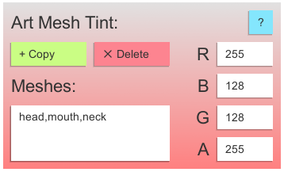
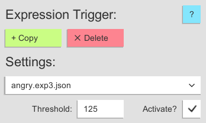

# VTS-Heartrate
A VTube Studio plugin that allows for connectivity between heart rate monitors (HRM) and VTube Studio!
 
[Download the latest version here!](https://skeletom-ch.itch.io/vts-heartrate) Or, in the [release section](https://github.com/FomTarro/vts-heartrate/releases) of this repo.

 
# Features

💓 Support for <b>many heart rate monitors</b> with [pulsoid.net](ttps://www.pulsoid.net)!  

💓 Configurable <b>model tinting</b> that scales with pulse!

💓 Custom <b>tracking parameters</b> for pulse and breath!

# About
This plugin is developed by Tom "Skeletom" Farro. If you need to contact him, the best way to do so is via Twitter.

If you're more of an email-oriented person, you can contact his support email: tom@skeletom.net.

# Usage
Getting up and running is relatively straightforward. The plugin will automatically connect to VTube Studio on launch. From there, do the following steps:

* Input an estimated <b>minimum</b> and <b>maximum</b> heartrate.
* Select a desired heartrate <b>input method</b>. Currently, in order to use an actual Heart Rate Monitor, a pulsoid.net account is needed. More input methods on the way!
* Add [<b>Art Mesh Tint modules</b>](#art-mesh-tinting) and configure them to parts of your model!
* Hook up your model to [<b>Custom Tracking Parameters</b>](#custom-tracking-parameters), if you want!
 

 
## Heartrate Input Methods
In the interest of being widely accessible, this plugin features a wide set of possible input methods, which you may freely switch between at any time.
 
### Test Slider
The slider is primarily useful for quick testing of different heartrate values. The slider range is from 0 to 255.
 
### Read from File
This input method allows you to read heartrate data from an external file.
The file must simply contain the <b>numeric heartrate value</b> in <b>plain text</b>. File path must be absolute. Useful if you have another program that can output heartrate data.
 
### Pulsoid App
[<b>Pulsoid</b>](https://www.pulsoid.net) is a free third-party app for Android/iOS which allows for easy, reliable connectivity to a wide set of heartrate monitors. Once you have a Pulsoid account, you can use this input method to collect heartrate data from the service.
 
By clicking the <b>'Login' button</b> in the plugin, you will be asked to grant this plugin permission to connect to your account. You will then be given an <b>'Authentication Token'</b> which you must paste into the plugin.
 
### Pulsoid Feed Reference
<b>Pulsoid</b> is a free third-party app for Android/iOS which allows for easy, reliable connectivity to a wide set of heartrate monitors. Once you have a Pulsoid account, you can use this input method to collect heartrate data from the service.
 
To use this input method, navigate to your <b>Pulsoid account page</b>, and then go to [<b>Widgets -> Advanced</b>](https://pulsoid.net/ui/configuration). From there, you should find a <b>'Feed URL'</b> which you must paste into the plugin.
 
Please note that Pulsoid may be deprecating this input method in the future, in favor of direct app connectivity.
 
 
## Outputs
 
### Art Mesh Tinting
This output will gradually tint the matched <b>Art Meshes</b> the desired color, based on your current heartrate. For example, you can use this to make your model's face flushed for workouts, or run cold during horror games.
 
<b>Art Meshes</b> are matched as long as their names or tags contain <b>any</b> of the provided list of text to match. For example, providing the text '<b>head,mouth,neck</b>' will match Art Meshes with names like '<b>forehead</b>', '<b>outermouth2</b>', and '<b>leftneckside1</b>'.
Text to match must be <b>comma separated</b> and should <b>not contain spaces</b>.
 
If you are unsure of what your Art Meshes are named, a great web-tool was developed by <b>Hawkbar</b> called [<b>VTubeStudioTagger</b>](https://hawk.bar/VTubeStudioTagger/), which offers an intuitive way to discover the names of your model's Art Meshes.
 

### Automatic Expression Triggering
This output will cause an <b>Expression</b> to activate or deactivate when the current heartrate <b>exceeds a given threshold</b>. The Expression will then resume its original state once the heartrate dips back below the given threshold. 

For example, the configuration in the provided image will cause the `angry` Expression to automatically activate when the heartrate exceeds 125 BPM, and will deactivate when the heartrate falls back beneath 125 BPM.

 
### Custom Tracking Parameters
This plugin outputs <b>three custom tracking parameters</b> for use. They are as follows:
 
* `VTS_Heartrate_Linear`: A value that scales from 0.0 to 1.0 as your heartrate moves across the expected range.
* `VTS_Heartrate_Pulse`: A value that oscillates between 0.0 and 1.0 with a frequency exactly matching your heartrate.
* `VTS_Heartrate_Breath`: A value that oscillates between 0.0 and 1.0 with a frequency slower than Pulse, suitable for controlling your model's <b>ParamBreath</b> output.
* `VTS_Heartrate_BPM`: A value that represents the actual current heartrate in BPM.
 

### Copy Profile Settings
As of version 1.0.0, settings are saved on a per-model basis. This feature allows you to <b>copy all of your output settings</b> (art mesh tints, expression triggers) from one model to your currently loaded model.

As a result, any settings configured for your currently loaded model will be permanently erased.
 
# Roadmap
 
Planned features include the following:
* The ability to directly connect to your Bluetooth HRM via Windows as an input method (I have been working at this for months, and it is not very reliable currently! Sorry!!!)
* More robust system logging

