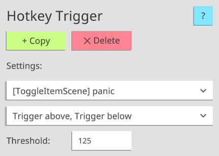

# VTS-Heartrate
A VTube Studio plugin that allows for connectivity between heart rate monitors (HRM) and VTube Studio!
 
[Download the latest version here!](https://skeletom-ch.itch.io/vts-heartrate) Or, in the [release section](https://github.com/FomTarro/vts-heartrate/releases) of this repo.

 
# Features

💓 Support for <b>many heart rate monitors</b> with [pulsoid.net](https://www.pulsoid.net) and [ANT+](https://www.thisisant.com/consumer/ant-101/what-is-ant)!  

💓 Configurable <b>model tinting</b> that scales with pulse!

💓 Automatic <b>expression and hotkey triggering</b> at desired heartrate thresholds!

💓 Custom <b>tracking parameters</b> for pulse and breath!

# About
This plugin is developed by Tom "Skeletom" Farro. If you need to contact him, the best way to do so is via [Twitter](https://www.twitter.com/FomTarro).

If you're more of an email-oriented person, you can contact his support email: [tom@skeletom.net](mailto:tom@skeletom.net).

# Usage
Getting up and running is relatively straightforward. The plugin will automatically connect to VTube Studio on launch. From there, do the following steps:

* Input an estimated <b>minimum</b> and <b>maximum</b> heartrate.
* Select a desired heartrate <b>input method</b>. You can connect over bluetooth using your phone and [pulsoid.net](https://www.pulsoid.net), or connect directly to your PC with an [ANT+](https://www.thisisant.com/consumer/ant-101/what-is-ant) USB dongle.
* Add [<b>Art Mesh Tint modules</b>](#art-mesh-tinting) and configure them to parts of your model!
* Add [<b>Expression and Hotkey Trigger modules</b>](#automatic-expression-triggering) and configure them to activate model functions automatically!
* Hook up [<b>Custom Tracking Parameters</b>](#custom-tracking-parameters), to your model for things like breathing speed!
 

 
## Heartrate Input Methods
In the interest of being widely accessible, this plugin features a wide set of possible input methods, which you may freely switch between at any time.
 
### Test Slider
The slider is primarily useful for quick testing of different heartrate values. The slider range is from 0 to 255.
 
### Read from File
This input method allows you to read heartrate data from an external file.
The file must simply contain the <b>numeric heartrate value</b> in <b>plain text</b>. File path must be absolute. Useful if you have another program that can output heartrate data.
 
### Pulsoid
[<b>Pulsoid</b>](https://www.pulsoid.net) is a free third-party app for Android/iOS which allows for easy, reliable connectivity to a wide set of heartrate monitors via the Bluetooth of your mobile device. Once you have a Pulsoid account, you can use this input method to collect heartrate data from the service.
 
By clicking the <b>'Login' button</b> in the plugin, you will be asked to grant this plugin permission to connect to your account. You will then be given an <b>'Authentication Token'</b> which you must paste into the plugin.
 
### ANT+
[<b>ANT+</b>](https://www.thisisant.com/consumer/ant-101/what-is-ant) is a low-power protocol supported by many sport and fitness sensors.

This input method allows for direct connection to your ANT+ device, provided that you have a <b>USB receiver</b> plugged in.

By clicking the <b>'Refresh' button</b>, this plugin will begin a continuous scan for devices that output heartrate data.
Then, simply select one from the dropdown and click the <b>'Connect' button</b>.

Please note that this plugin is not an officially licensed or certified affiliate of the ANT+ Brand.
 
 
## Outputs
 
### Art Mesh Tinting
This output will gradually tint the matched <b>Art Meshes</b> the desired color, based on your current heartrate. For example, you can use this to make your model's face flushed for workouts, or run cold during horror games.
 
<b>Art Meshes</b> are matched as long as their names or tags contain <b>any</b> of the provided list of text to match. For example, providing the text '<b>head,mouth,neck</b>' will match Art Meshes with names like '<b>forehead</b>', '<b>outermouth2</b>', and '<b>leftneckside1</b>'.
Text to match must be <b>comma separated</b> and should <b>not contain spaces</b>.
 
If you are unsure of what your Art Meshes are named, a great web-tool was developed by <b>Hawkbar</b> called [<b>VTubeStudioTagger</b>](https://hawk.bar/VTubeStudioTagger/), which offers an intuitive way to discover the names of your model's Art Meshes.
 

### Automatic Expression Triggering
This output will cause an <b>Expression</b> to <b>activate or deactivate</b> when the current heartrate is <b>above or below a given threshold</b>, based on the selected behavior settings.

For example, the configuration in the provided image will cause the `angry` Expression to automatically activate when the heartrate exceeds 125 BPM, and will deactivate when the heartrate falls back beneath 125 BPM.

### Automatic Hotkey Triggering
This output will cause a <b>Hotkey</b> to be triggered when the current heartrate is <b>above or below a given threshold</b>, based on the selected behavior settings.
 
For example, the configuration in the provided image will cause the `panic` Item Scene to automatically toggle when the heartrate exceeds 125 BPM, and will toggle again when the heartrate falls back beneath 125 BPM.

### Custom Tracking Parameters
This plugin outputs <b>four custom tracking parameters</b> for use. They are as follows:
 
* `VTS_Heartrate_Linear`: A value that scales from 0.0 to 1.0 as your heartrate moves across the expected range.
* `VTS_Heartrate_Pulse`: A value that oscillates between 0.0 and 1.0 with a frequency exactly matching your heartrate.
* `VTS_Heartrate_Breath`: A value that oscillates between 0.0 and 1.0 with a frequency slower than `VTS_Heartrate_Pulse`, suitable for controlling your model's `ParamBreath` output parameter.
* `VTS_Heartrate_BPM`: A value that represents the actual current BPM from 0 to 255, rather than a normalized value from 0.0 to 1.0.

For more information on how to integrate these tracking parameters into your model, please refer to the [Official VTube Studio documentation](https://github.com/DenchiSoft/VTubeStudio/wiki/Plugins#what-are-custom-parameters).
 

### Copy Profile Settings
As of version 1.0.0, settings are saved on a per-model basis. This feature allows you to <b>copy all of your output settings</b> (art mesh tints, expression triggers) from one model to your currently loaded model.

As a result, any settings configured for your currently loaded model will be permanently erased.
 
# Roadmap
 
Planned features include the following:
* Localization into additional languages
* More robust system logging

